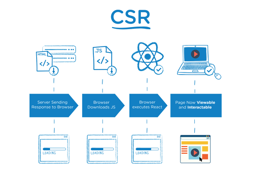
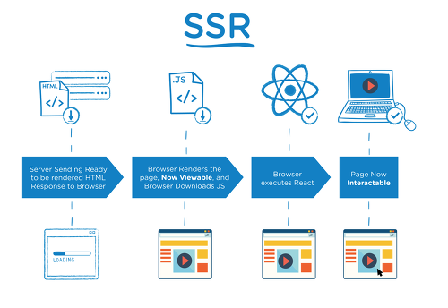

## Question 1. 서버 사이드 렌더링과 클라이언트 사이드 렌더링이란?

## 클라이언트 사이드 렌더링



리액트 어플리케이션은 SPA(싱글 페이지 어플리케이션)으로, 보통 public 폴더에 존재하는 index.html 하나에서 다른 컴포넌트를 렌더링한다.  
클라이언트 사이드 렌더링을 설명하기 위해 잠깐 기본 리액트에 대한 설명을 해보겠다.

```
<!-- index.html -->
    ...
    <title>React App</title>
  </head>
  <body>
    <noscript>You need to enable JavaScript to run this app.</noscript>
    <div id="root"></div>
  </body>
</html>
```

```
// index.js
ReactDOM.render(
  <React.StrictMode>
    <App />
  </React.StrictMode>,
  document.getElementById("root")
);
```

기본 `create-react-app` 으로 생성되는 index.html은 이런 형태를 띄고 있으며, index.js로 인해 `<div id = "root">` 내에 리액트 컴포넌트가 그려진다.  
이후 `react-router-dom` 등 라우팅 라이브러리를 사용해 다른 페이지로 이동하면 서버에서 다른 페이지를 보내주는 것이 아니라 클라이언트에서 다른 페이지를 그려내는 것이다.

이를 클라이언트 사이드 렌더링이라 하는데, 여기에는 몇 가지 치명적인 단점이 있다.  
먼저 사용자가 서버로부터 페이지를 요청하면 서버는 페이지뿐만 아니라 자바스크립트 파일을 통째로 내려줘야만 해 초기 로딩시간이 매우 길어지며(이는 코드 스플리팅으로 해소할 수 있긴 하다.), **검색 엔진**에서는 `index.html`만을 크롤링할 수 있기 때문에 검색 노출에 어려움을 겪게 된다.

## 서버 사이드 렌더링



그래서 등장한 기법이 바로 서버 사이드 렌더링이다.  
서버 사이드 렌더링은 화면을 서버에서 렌더링한 후 HTML 결과물을 클라이언트에 내려줘 첫 로딩이 매우 짧고 SEO(검색엔진 최적화)에도 유리하다는 장점이 있다.  
다만 사용자가 다른 화면을 볼 때마다 서버에 계속 요청을 보내야 하므로 서버에 부담이 간다는 단점이 있다.

리액트 서버 사이드 렌더링을 위한 프레임워크로는 gatsby, next.js 가 있다.

## TL;DR

#### [클라이언트 사이드 렌더링]

- 초기 응답속도 느림
- 검색엔진 최적화 X
- 서버 부담 Low(비교적)

#### [서버 사이드 렌더링]

- 초기 응답속도 빠름
- 검색엔진 최적화 O
- 서버 부담 High
